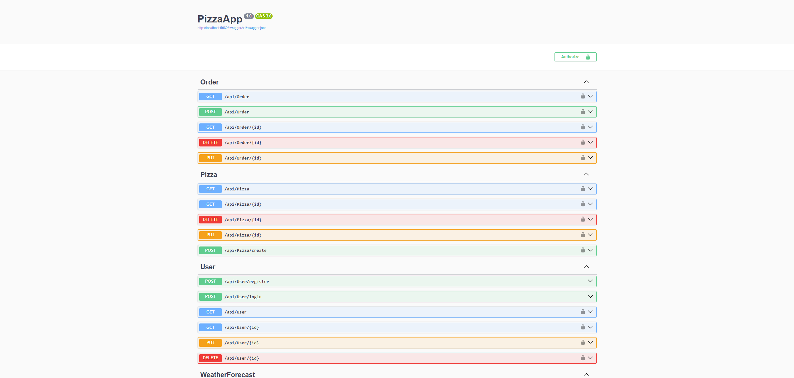
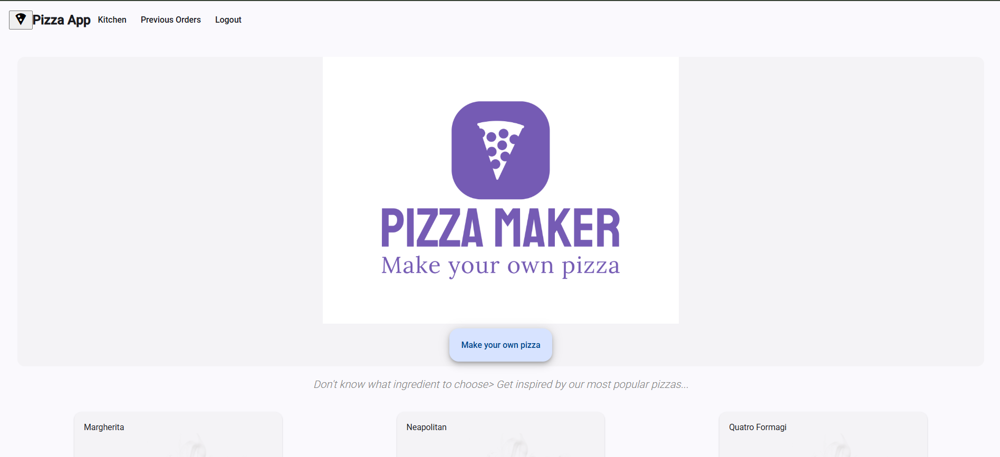
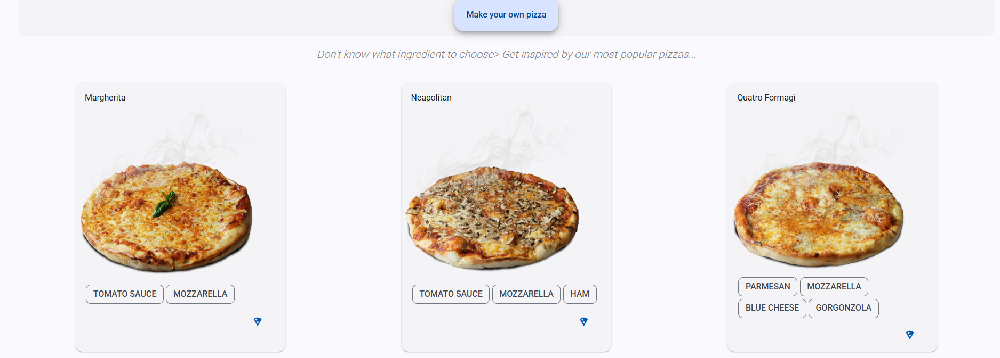

# 🍕 Pizza App – Web API (.NET 8) + Angular  
A full-stack pizza ordering application built as part of my **Avenga Academy** program.  
This project showcases a complete modern web application using a **.NET 8 Web API** backend, **Angular** frontend, and a clean, scalable architecture.

---

## 🚀 Tech Stack

### **Backend – .NET 8 Web API**
- .NET 8  
- Entity Framework Core  
- **PostgreSQL** + **Npgsql** provider  
- Repository & Service Layer Architecture  
- JWT Authentication  
- AutoMapper  
- FluentValidation  
- Clean, modular solution structure  

### **Frontend – Angular**
- Angular 15+  
- TypeScript  
- RxJS  
- Angular Material  
- Responsive UI design  

---

## 🎯 Project Features

### 🍕 **User Features**
- Browse and view pizzas  
- Customize pizzas (size, ingredients, quantity)  
- Add items to cart  
- Place orders  
- View order history  
- Authentication (JWT login/register)

### 🛠️ **Admin Features**
- Create, edit, delete pizzas  
- Manage ingredients  
- Manage and update order statuses  
- View all orders  
- Dashboard-like overview  

---

## 🧱 Architecture Overview

### **Backend Structure**
- **Controllers** – REST API endpoints  
- **Services** – Business logic  
- **Repositories** – EF Core data access  
- **Entities & DTOs** – Clean separation  
- **AutoMapper Profiles** – Mapping layer  
- **FluentValidation** – Input validation  
- **JWT Auth** – Token & role-based authorization  

### **Frontend Structure**
- Modular Angular components  
- API Services for communication  
- Route guards & interceptors  
- Angular Material UI components  
- Reactive forms & RxJS logic  

---

## 📸 Screenshots

### **Backend API Overview**


### **Frontend – Landing / Hero Section**


### **Frontend – Pizza View**


---

## 🔧 Running the Project

### **Backend (.NET 8)**
```bash
cd backend
dotnet restore
dotnet ef database update
dotnet run
